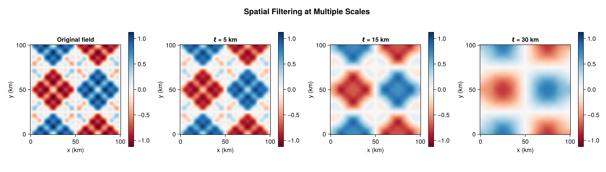
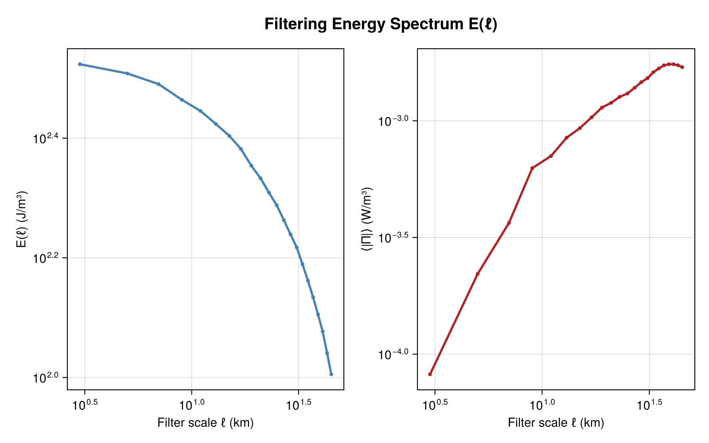
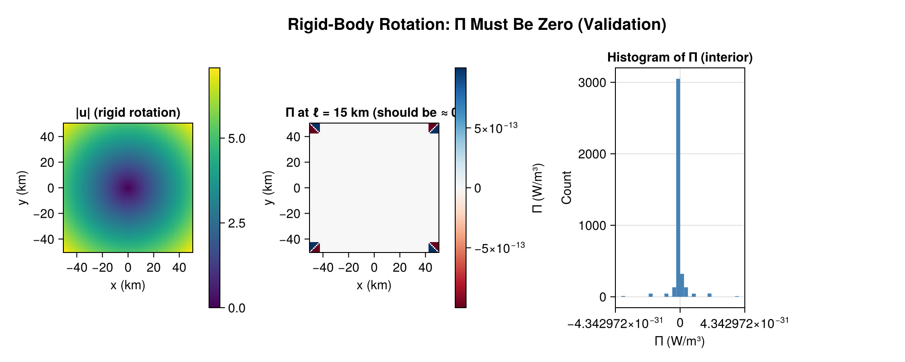

# CoarseGrainingEnergyFluxes.jl

Spatial coarse-graining analysis of energy fluxes in geophysical fluid dynamics. Computes cross-scale kinetic energy transfer Π(x, ℓ) and filtering energy spectra E(ℓ) from velocity fields on Cartesian or spherical grids.

## What This Package Does

Coarse-graining (spatial filtering) decomposes turbulent flows into scale-dependent contributions. This package computes:

- **Cross-scale energy flux** Π(x, ℓ): the local rate of kinetic energy transfer across scale ℓ
- **Filtering energy spectrum** E(ℓ): the domain-averaged kinetic energy at scale ℓ

These are defined via the filtered velocity field ū_ℓ and the sub-scale stress tensor τ_ℓ:

```
Π(x, ℓ) = −τ_ℓ : S̄_ℓ
where τ_ℓ = (u ⊗ u)̄_ℓ − ū_ℓ ⊗ ū_ℓ
```

## Results

### Spatial Filtering at Multiple Scales



### Cross-Scale Energy Flux Π(x, ℓ)


### Filtering Energy Spectrum E(ℓ) and Mean |Π|



### Validation: Rigid-Body Rotation → Π = 0



## Quick Start

```julia
using CoarseGrainingEnergyFluxes

# Create grid
geom = SphericalGeometry(6.371e6)  # Earth radius in meters
grid = StructuredGrid(geom, lon_rad, lat_rad, land_mask)

# Run multi-scale analysis
scales = collect(10e3:10e3:300e3)  # 10 km to 300 km
result = coarse_grain(u, v, grid; scales=scales, kernel=TopHatKernel())

# result.Π[i]       — energy flux map at scales[i]
# result.spectrum[i] — filtering energy at scales[i]
# result.scales      — filter scales in meters
```

## Architecture

```
src/
  Geometry.jl     — CartesianGeometry, SphericalGeometry
  Grids.jl        — StructuredGrid, CurvilinearGrid, UnstructuredGrid
  Kernels.jl      — TopHatKernel, GaussianKernel, SharpSpectralKernel
  Filtering.jl    — filter_field! (core convolution engine)
  Derivatives.jl  — Finite-difference stencils (ddx!, ddy!, ddz!)
  Helmholtz.jl    — Helmholtz decomposition (SOR Poisson solver)
  Diagnostics.jl  — compute_Π!, compute_filtering_spectrum
  Pipeline.jl     — coarse_grain (high-level orchestration)
ext/
  FFTWExt         — FFT-based spectral filtering (Cartesian periodic)
  FINUFFTExt      — Non-uniform FFT filtering (irregular grids)
  FastTransformsExt — Spherical harmonic transforms
  GPUExt          — KernelAbstractions GPU backend
  OhMyThreadsExt  — Threaded execution backend
  DistributedExt  — Distributed (MPI-like) backend
  CairoMakieExt   — Visualization helpers
  NCDatasetsExt   — NetCDF I/O
  CSVExt          — CSV export
  ZarrExt         — Zarr I/O
```

## Filter Kernels

| Kernel | Description | Use case |
|--------|-------------|----------|
| `TopHatKernel()` | Uniform weight within radius ℓ | Standard, most common |
| `GaussianKernel()` | Gaussian with std ℓ/2 | Smooth, differentiable |
| `SharpSpectralKernel()` | Ideal low-pass in spectral space | Requires FFT extension |

## Execution Backends

| Backend | Extension | Description |
|---------|-----------|-------------|
| `SerialBackend()` | — | Single-threaded (default for small grids) |
| `ThreadedBackend()` | OhMyThreads | Multi-threaded with work-stealing |
| `GPUBackend()` | KernelAbstractions | GPU acceleration |
| `FINUFFTBackend()` | FINUFFT | Non-uniform FFT (O(N log N)) |
| `DistributedBackend()` | Distributed | Multi-process with SharedArrays |
| `AutoBackend()` | — | Automatically selects best available |

## Spherical Commutativity Note

On the sphere, filtering velocity Cartesian components does **NOT** commute with differential operators (Aluie 2019). This package currently uses the "planetary Cartesian" approach, which is:
- **Exact** for non-divergent velocity (e.g., SSH-derived geostrophic flow)
- **Approximate** for full velocity with divergent components

For the theoretically correct approach with general velocity fields, use [HelmholtzDecomposition.jl](https://github.com/jbphyswx/HelmholtzDecomposition.jl) to decompose into scalar potentials, filter those as scalars, then reconstruct. See Buzzicotti et al. (2023) for the workflow.

## References

- **Aluie (2019)**: doi:10.1007/s13137-019-0123-9 — Convolutions on the sphere
- **Aluie, Hecht, Vallis (2018)**: doi:10.1175/JPO-D-17-0100.1 — Mapping the energy cascade
- **Storer et al. (2022)**: doi:10.1038/s41467-022-33031-3 — Global energy spectrum
- **Buzzicotti et al. (2023)**: doi:10.1126/sciadv.adi7420 — Global cascade of kinetic energy
- **Aluie (2011)**: doi:10.1016/j.physd.2011.06.001 — Compressible turbulence coarse-graining

## See Also

- [HelmholtzDecomposition.jl](https://github.com/jbphyswx/HelmholtzDecomposition.jl) — Helmholtz decomposition for correct spherical filtering
- [StructureFunctions.jl](https://github.com/jbphyswx/StructureFunctions.jl) — Structure function analysis (complementary to filtering)
- [FlowSieve](https://flowsieve.readthedocs.io/) — C++ coarse-graining toolkit (Storer et al.)
