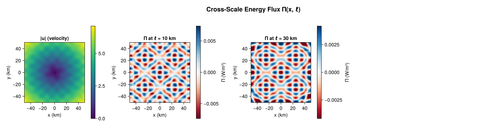

# Examples

All examples follow the package import policy: bring the module in under a stable alias and qualify
every call.

```julia
using CoarseGrainingEnergyFluxes: CoarseGrainingEnergyFluxes as CGEF
```

## Visual Results

### Spatial Filtering at Multiple Scales


### Cross-Scale Energy Flux Π(x, ℓ)


### Filtering Energy Spectrum and Mean |Π|


### Validation: Rigid-Body Rotation → Π = 0


## Cartesian domain — flux at one scale and across scales

```julia
using CoarseGrainingEnergyFluxes: CoarseGrainingEnergyFluxes as CGEF

dx = 1_000.0; N = 100                       # 100 km × 100 km patch, 1 km spacing
geom = CGEF.CartesianGeometry(dx, dx)
xs = collect(0.0:dx:(N - 1) * dx)
ys = collect(0.0:dx:(N - 1) * dx)
grid = CGEF.StructuredGrid(geom, xs, ys, trues(N, N))

u = randn(N, N); v = randn(N, N)            # replace with your data

# Π at a single 10 km scale.
Π = zeros(N, N)
CGEF.compute_Π!(Π, u, v, nothing, grid, CGEF.TopHatKernel(), 10_000.0)

# Multi-scale sweep (plan reuse handled internally).
scales = collect(5e3:5e3:50e3)
result = CGEF.coarse_grain(u, v, grid; scales = scales, kernel = CGEF.TopHatKernel())
result.Π[3]                  # flux map at scales[3]
result.cumulative_energy     # ½ρ₀⟨|ū_ℓ|²⟩ per scale (Sadek–Aluie Eq. 15)
result.wavenumber            # k_ℓ = L/ℓ
result.filtering_spectrum    # Ẽ(k_ℓ) density (Eq. 14)
```

## Spherical ocean domain with a land mask

```julia
using CoarseGrainingEnergyFluxes: CoarseGrainingEnergyFluxes as CGEF

geom = CGEF.SphericalGeometry(6.371e6)
lon = deg2rad.(collect(0.0:0.25:359.75))
lat = deg2rad.(collect(-80.0:0.25:80.0))
mask = trues(length(lon), length(lat))      # or load a real land/sea mask

grid = CGEF.StructuredGrid(geom, lon, lat, mask)   # full-circle lon ⇒ periodic auto-detected
# u, v = load_velocity(...)

scales = collect(10e3:10e3:300e3)
result = CGEF.coarse_grain(u, v, grid; scales = scales, kernel = CGEF.TopHatKernel())
```

The `Deformable` mask strategy (default) renormalizes the kernel over wet points near coastlines;
pass `mask_strategy = CGEF.ZeroFill()` to treat land as zeros instead.

## Execution backends (real-space `DirectSum`)

The backend only changes *how* the same footprint convolution is evaluated — results are identical.

```julia
using OhMyThreads: OhMyThreads          # enables ThreadedBackend
result = CGEF.coarse_grain(u, v, grid; scales = scales, backend = CGEF.ThreadedBackend())

using KernelAbstractions: KernelAbstractions   # enables GPUBackend (CPU device shown)
result = CGEF.coarse_grain(u, v, grid; scales = scales, backend = CGEF.GPUBackend())

# AutoBackend (default) picks ThreadedBackend when Threads.nthreads() > 1, else SerialBackend.
```

## Spectral filtering (`method = Spectral()`)

Spectral filtering multiplies by Ĝ(k) and is selected by the grid type (FFTW / FINUFFT /
FastSphericalHarmonics / NUFSHT). It assumes a homogeneous domain (no land mask). Use a Gaussian or
sharp-spectral kernel — the top-hat is unsupported spectrally.

```julia
using FFTW: FFTW                       # uniform periodic Cartesian
N = 128; dx = 1.0
geom = CGEF.CartesianGeometry(dx, dx)
x = collect(0.0:dx:dx*(N - 1))
grid = CGEF.StructuredGrid(geom, x, x, trues(N, N); periodic = (true, true))

out = zeros(N, N)
CGEF.filter_field!(out, u, grid, CGEF.GaussianKernel(), 4.0; method = CGEF.Spectral())
```

Scattered Cartesian points use `FINUFFT` on an `UnstructuredGrid{Cartesian}`; uniform spherical grids
use `FastSphericalHarmonics` on a `StructuredGrid{Spherical}`; scattered spherical points use `NUFSHT`
on an `UnstructuredGrid{Spherical}`. In every case the call is the same `filter_field!(…; method =
CGEF.Spectral())` — only the grid type differs.

## Rotational / divergent (Helmholtz) flux decomposition

Pass the rotational (solenoidal) velocity from a Helmholtz solver
([HelmholtzDecomposition.jl](https://github.com/jbphyswx/HelmholtzDecomposition.jl)); the divergent
part is taken as the complement.

```julia
using CoarseGrainingEnergyFluxes: CoarseGrainingEnergyFluxes as CGEF
# u_rot, v_rot = HelmholtzDecomposition.rotational_part(u, v, grid)

dec = CGEF.compute_Π_decomposed(u, v, u_rot, v_rot, grid, CGEF.TopHatKernel(), 20_000.0)
dec.total        # == compute_Π! full flux
dec.rotational   # Πʳʳ
dec.cross        # Πʳᵈ + Πᵈʳ
dec.divergent    # Πᵈᵈ      (dec.rotational .+ dec.cross .+ dec.divergent ≈ dec.total)
```

## Tracer / buoyancy variance flux

```julia
# θ is any tracer (buoyancy b = -g ρ'/ρ₀ gives the APE-related transfer).
Πθ = CGEF.tracer_variance_flux(u, v, θ, grid, CGEF.TopHatKernel(), 20_000.0)
```

## Stress decomposition (Leonard / Cross / Reynolds)

```julia
d = CGEF.tau_decomposition(u, v, grid, CGEF.TopHatKernel(), 20_000.0)
d.L.xx; d.C.xy; d.R.yy        # d.L + d.C + d.R == τ exactly
```

## Visualization (CairoMakie extension)

```julia
using CairoMakie: CairoMakie               # provides plot_Π_map / plot_spectrum methods
result = CGEF.coarse_grain(u, v, grid; scales = collect(10e3:10e3:100e3))

fig1 = CGEF.plot_Π_map(result, 3, grid)               # flux map at scales[3]
fig2 = CGEF.plot_spectrum(result; which = :density)   # filtering spectral density Ẽ(k_ℓ)
fig3 = CGEF.plot_spectrum(result; which = :cumulative) # cumulative coarse KE vs ℓ
```
