# Examples

All examples follow the package import policy: bring each module in under a stable alias and qualify
every call. Only a minimal set of names is exported at the top level (`coarse_grain`,
`coarse_grain!`, `coarse_grain_profile`, `CoarseGrainResult`, the three kernels,
`plot_Π_map`/`plot_spectrum`); everything else — `filter_field!`, `compute_Π!`,
`compute_Π_decomposed`, `tau_decomposition`, `tracer_variance_flux`, backends, mask strategies,
`Spectral()`/`RealSpace()` — is reached through its submodule (`CGEF.Filtering...`,
`CGEF.Diagnostics...`, `CGEF.ComputationalBackends...`), never a flattened top-level re-export.
Geometries and grid types come from FlowGeometries.jl.

```julia
using CoarseGrainingEnergyFluxes: CoarseGrainingEnergyFluxes as CGEF
using FlowGeometries: FlowGeometries as FG
```

## Visual Results

### The coarse-graining pipeline
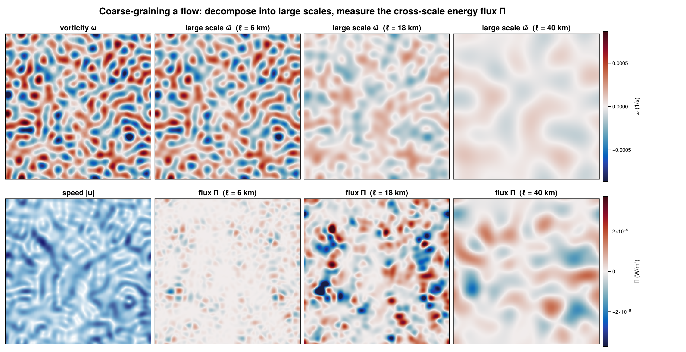

### Spatial filtering across scales
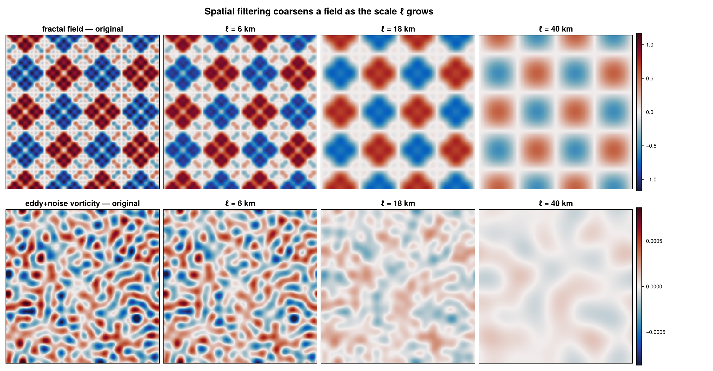

### Filter kernels and spectral transfer
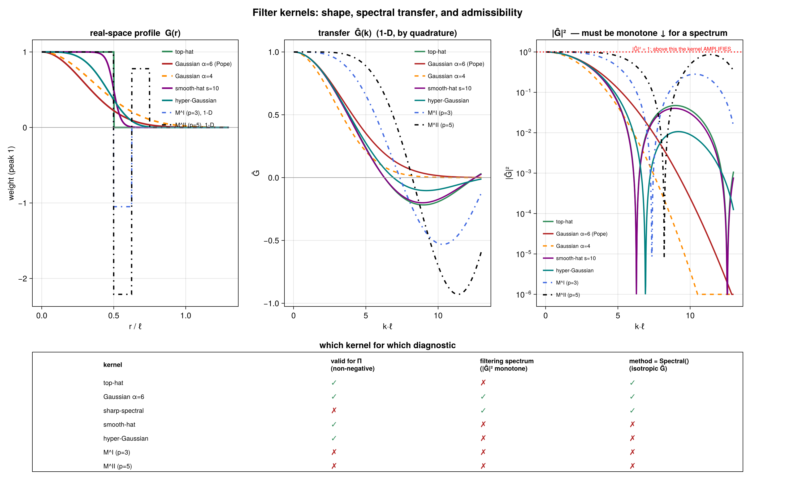

### The filtering spectrum (recovers the Fourier slope)
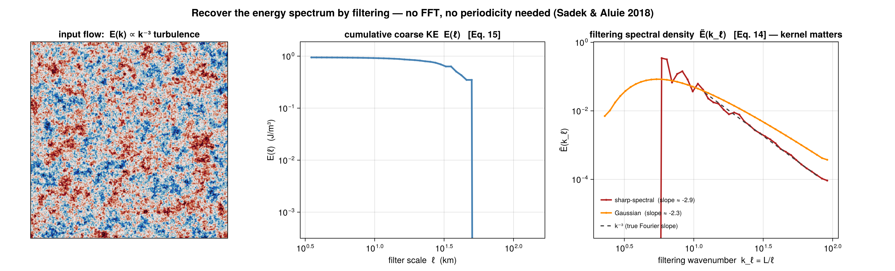

### Rotational / divergent (Helmholtz) decomposition of Π
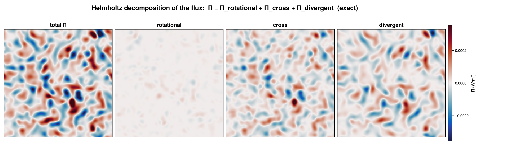

### Cross-scale tracer / buoyancy-variance flux
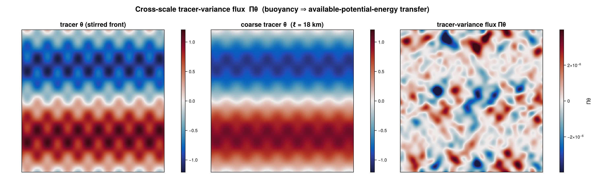

### Masking: deformable vs zero-fill
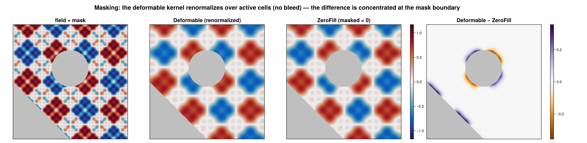

### Spectral filtering on the sphere
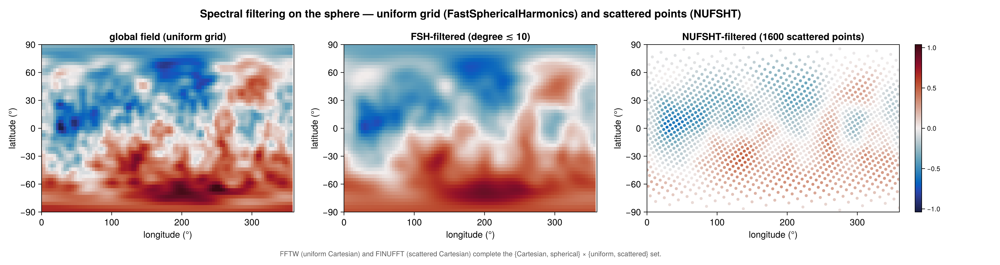

### Validation: rigid-body rotation → Π = 0
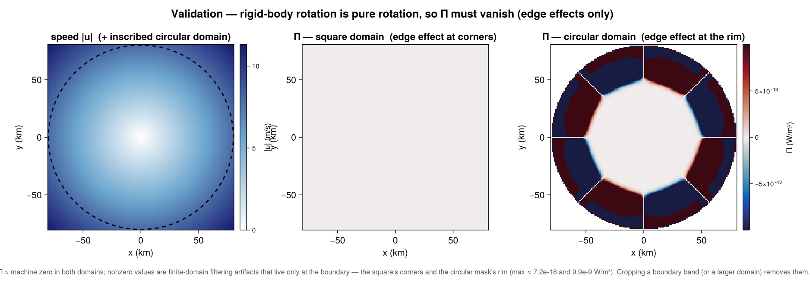

### Curvilinear (model-native) grids
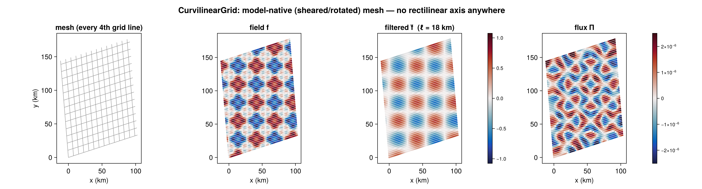

### Scattered / unstructured point clouds
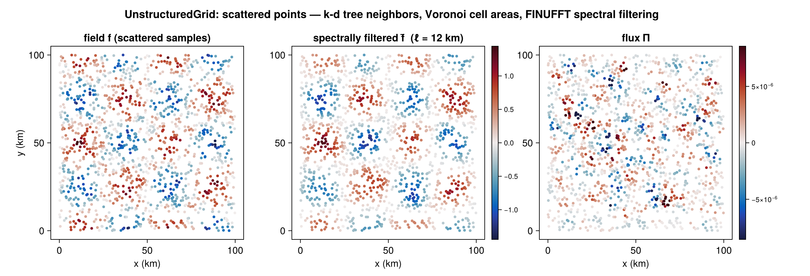

### True 3D volumetric flux
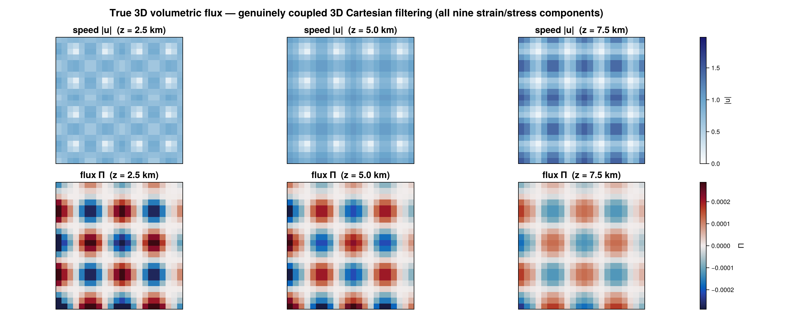

### Vertical profile (2.5D per-level) vertical structure
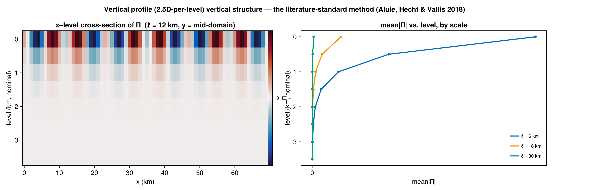

## Cartesian domain — flux at one scale and across scales

```julia
using CoarseGrainingEnergyFluxes: CoarseGrainingEnergyFluxes as CGEF
using FlowGeometries: FlowGeometries as FG

dx = 1_000.0; N = 100                       # 100 km × 100 km patch, 1 km spacing
geom = FG.Geometry.CartesianGeometry()
xs = collect(0.0:dx:(N - 1) * dx)
ys = collect(0.0:dx:(N - 1) * dx)
grid = FG.Grids.StructuredGrid(geom, xs, ys)   # no mask ⇒ `AllActive`; see below to exclude cells

u = randn(N, N); v = randn(N, N)            # replace with your data

# Π at a single 10 km scale.
Π = zeros(N, N)
CGEF.Diagnostics.compute_Π!(Π, u, v, nothing, grid, CGEF.TopHatKernel(), 10_000.0)

# Multi-scale sweep (plan reuse handled internally).
scales = collect(5e3:5e3:50e3)
result = CGEF.coarse_grain(u, v, grid; scales = scales, kernel = CGEF.TopHatKernel())
@view result.Π[:, :, 3]      # flux map at scales[3] — result.Π is a stacked (Nx,Ny,Nscales) array
result.cumulative_energy     # ½ρ₀⟨|ū_ℓ|²⟩ per scale (Sadek–Aluie Eq. 15)
result.wavenumber            # k_ℓ = L/ℓ
result.filtering_spectrum    # Ẽ(k_ℓ) density (Eq. 14)
```

## Spherical domain with a mask

```julia
using CoarseGrainingEnergyFluxes: CoarseGrainingEnergyFluxes as CGEF
using FlowGeometries: FlowGeometries as FG

geom = FG.Geometry.SphericalGeometry(6.371e6)
lon = deg2rad.(collect(0.0:0.25:359.75))
lat = deg2rad.(collect(-80.0:0.25:80.0))
grid = FG.Grids.StructuredGrid(geom, lon, lat)   # full-circle lon ⇒ periodic auto-detected
# u, v = load_velocity(...)

scales = collect(10e3:10e3:300e3)
result = CGEF.coarse_grain(u, v, grid; scales = scales, kernel = CGEF.TopHatKernel())
```

The `Deformable` mask strategy (default) renormalizes the kernel over active points near the mask
boundary; pass `mask_strategy = CGEF.Filtering.ZeroFill()` to treat excluded cells as zeros instead.

## Curvilinear (model-native) grids

`CurvilinearGrid` needs no rectilinear axis assumption at all — every point carries its own
`(x, y)`, and derivatives/filtering/`Π` all work directly off the 2D coordinate arrays via a
per-point footprint and weighted-least-squares (WLSQ) gradients. A common source is a
structured-grid ocean/atmosphere model's curvilinear cell-center grid; here's a synthetic
sheared/rotated example:

```julia
using CoarseGrainingEnergyFluxes: CoarseGrainingEnergyFluxes as CGEF
using FlowGeometries: FlowGeometries as FG

N = 60; dx = 2_000.0
geom = FG.Geometry.CartesianGeometry()
i = collect(0.0:(N - 1)); j = collect(0.0:(N - 1))
θ = deg2rad(15.0); shear = 0.3                       # rotate + shear a rectilinear index grid
x = [dx * (ii * cos(θ) - jj * shear * sin(θ)) for ii in i, jj in j]
y = [dx * (ii * sin(θ) + jj * (1 + shear * cos(θ))) for ii in i, jj in j]
grid = FG.Grids.CurvilinearGrid(geom, x, y)     # exact corner-based cell areas, auto-reconstructed

u = randn(N, N); v = randn(N, N)
result = CGEF.coarse_grain(u, v, grid; scales = collect(10e3:10e3:60e3), kernel = CGEF.TopHatKernel())
```

## Scattered / unstructured point clouds

`UnstructuredGrid` is the full pipeline for genuinely scattered observations (moorings, drifters,
along-track altimetry): k-d tree neighbor search and Voronoi cell areas at construction time, WLSQ
gradients over that adjacency, and both filtering methods. `Spectral()` (FINUFFT/NUFSHT) is the
default — exact for a band-limited field and `O(n log n)`. Pass `method = CGEF.Filtering.RealSpace()`
when the kernel must be applied exactly as written, e.g. near a boundary or a masked region, where a
transform's global support is wrong.

```julia
using CoarseGrainingEnergyFluxes: CoarseGrainingEnergyFluxes as CGEF
using FlowGeometries: FlowGeometries as FG
using NearestNeighbors: NearestNeighbors        # enables k-d tree neighbor search
using DelaunayTriangulation: DelaunayTriangulation  # enables exact Voronoi cell areas (Cartesian)
using FINUFFT: FINUFFT                          # enables scattered-Cartesian spectral filtering

npts = 2_000
geom = FG.Geometry.CartesianGeometry()         # a placeholder — UnstructuredGrid has no fixed spacing
x = 100_000.0 .* rand(npts)
y = 100_000.0 .* rand(npts)
grid = FG.Grids.UnstructuredGrid(geom, x, y; k = 8)   # k-nearest adjacency + auto Voronoi areas

u = randn(npts); v = randn(npts)
Π = zeros(npts)
CGEF.Diagnostics.compute_Π!(Π, u, v, nothing, grid, CGEF.GaussianKernel(), 8_000.0)
```

For scattered spherical observations, build `grid` with `FG.Geometry.SphericalGeometry(R)` instead and load
`Quickhull` (Voronoi areas) and `NUFSHT` (spectral filtering) in place of `DelaunayTriangulation`/
`FINUFFT`.

## True 3D volumetric flux (Cartesian and spherical)

Distinct from the vertical-profile method below: a true 3D `StructuredGrid` filters in all three
directions with one kernel and computes the genuinely coupled 9-component strain/stress
contraction — the right tool for homogeneous/isotropic turbulence, not the standard
large-scale thin-layer level-stacking approach.

```julia
using CoarseGrainingEnergyFluxes: CoarseGrainingEnergyFluxes as CGEF
using FlowGeometries: FlowGeometries as FG

# Cartesian: (x, y, z) all uniform Range axes.
N = 24; dx = 500.0
geom = FG.Geometry.CartesianGeometry()
x = collect(0.0:dx:(N - 1) * dx); y = copy(x); z = copy(x)
grid = FG.Grids.StructuredGrid(geom, x, y, z)

u = randn(N, N, N); v = randn(N, N, N); w = randn(N, N, N)
Π = zeros(N, N, N)
CGEF.Diagnostics.compute_Π!(Π, u, v, w, grid, CGEF.TopHatKernel(), 5_000.0)

# Spherical volumetric shell: (lon, lat, radius); Nz ≥ 2 is required (else use the 2D constructor).
R = 6.371e6
sgeom = FG.Geometry.SphericalGeometry(R)
lon = deg2rad.(collect(0.0:2.0:358.0)); lat = deg2rad.(collect(-80.0:2.0:80.0))
r = collect((R - 2000.0):500.0:R)                     # 5 levels spanning the top 2 km
sgrid = FG.Grids.StructuredGrid(sgeom, lon, lat, r)
```

## Vertical profile (2.5D per-level) vertical structure

The literature-standard method (Aluie, Hecht & Vallis 2018): run the existing 2D/2.5D `compute_Π!`
independently at each vertical level of a 3D `(x, y, z)` array and stack the profile — not to be
confused with the coupled true-3D method above.

```julia
using CoarseGrainingEnergyFluxes: CoarseGrainingEnergyFluxes as CGEF
using FlowGeometries: FlowGeometries as FG

geom = FG.Geometry.CartesianGeometry()
N = 80; Nz = 6
xs = collect(0.0:1_000.0:(N - 1) * 1_000.0)
grid = FG.Grids.StructuredGrid(geom, xs, xs)    # a 2D grid — z is a third array axis

u = randn(N, N, Nz); v = randn(N, N, Nz)                 # (x, y, z)
scales = collect(5e3:5e3:30e3)
result = CGEF.coarse_grain_profile(u, v, grid; scales = scales, kernel = CGEF.TopHatKernel())
result.Π[:, :, :, 3]              # flux profile at scales[3], all Nz levels
result.cumulative_energy[:, 3]    # per-level cumulative energy at scales[3]
```

## Execution backends (real-space `RealSpace`)

The backend only changes *how* the same footprint convolution is evaluated — results are identical.
Every backend reuses a footprint/plan built once per `(grid, kernel, scale)`, not rebuilt per call.

```julia
using OhMyThreads: OhMyThreads          # enables ThreadedBackend (2D row-parallel + 1D/3D point-parallel)
result = CGEF.coarse_grain(u, v, grid; scales = scales, backend = CGEF.ComputationalBackends.ThreadedBackend())

using KernelAbstractions: KernelAbstractions   # enables GPUBackend (2D grids only)
# Takes the device to run on — `KernelAbstractions.CPU()` here, `CUDABackend()`/`ROCBackend()` on a GPU.
result = CGEF.coarse_grain(u, v, grid; scales = scales,
                           backend = CGEF.ComputationalBackends.GPUBackend(KernelAbstractions.CPU()))

using MPI: MPI                          # enables MPIBackend (2D grids; requires MPI.Init() first)
result = CGEF.coarse_grain(u, v, grid; scales = scales, backend = CGEF.ComputationalBackends.MPIBackend())

# AutoBackend (default) picks ThreadedBackend when Threads.nthreads() > 1, else SerialBackend.
```

`MPIBackend`'s real multi-rank behavior (round-robin row decomposition + `Allreduce!`) is only
meaningfully exercised under `mpiexec -n P`; see `test/mpi_runtests.jl` for a runnable reference.

## Spectral filtering (`method = Spectral()`)

Spectral filtering multiplies by Ĝ(k) and is selected by the grid type (FFTW / FINUFFT /
FastSphericalHarmonics / NUFSHT). It requires a homogeneous (periodic / global) domain, but a partial
mask is supported — `ZeroFill`/`Deformable` work exactly as they do for `RealSpace()` (normalized
convolution, evaluated in Fourier/spherical-harmonic space). `GaussianKernel`/`SharpSpectralKernel`
work with no extra dependency; `TopHatKernel` needs `using SpecialFunctions` (for its exact planar
Bessel-`J₁` transfer function — the spherical-cap analog needs no extra dependency).

```julia
using FlowGeometries: FlowGeometries as FG
using FFTW: FFTW                       # uniform periodic Cartesian
N = 128; dx = 1.0
geom = FG.Geometry.CartesianGeometry()
x = collect(0.0:dx:dx*(N - 1))
grid = FG.Grids.StructuredGrid(geom, x, x; periodic = (true, true))

out = zeros(N, N)
CGEF.Filtering.filter_field!(out, u, grid, CGEF.GaussianKernel(), 4.0; method = CGEF.Filtering.Spectral())
```

Scattered Cartesian points use `FINUFFT` on an `UnstructuredGrid{Cartesian}`; uniform spherical grids
use `FastSphericalHarmonics` on a `StructuredGrid{Spherical}`; scattered spherical points use `NUFSHT`
on an `UnstructuredGrid{Spherical}`. In every case the call is the same `filter_field!(…; method =
CGEF.Filtering.Spectral())` — only the grid type differs.

## Rotational / divergent (Helmholtz) flux decomposition

Pass the rotational (solenoidal) velocity from a Helmholtz solver
([HelmholtzDecomposition.jl](https://github.com/jbphyswx/HelmholtzDecomposition.jl)); the divergent
part is taken as the complement. Both the strain and the stress are split before contracting (see
[Theory](theory.md)), giving three exact channels rather than a one-sided approximation.

```julia
using CoarseGrainingEnergyFluxes: CoarseGrainingEnergyFluxes as CGEF
# u_rot, v_rot = HelmholtzDecomposition.rotational_part(u, v, grid)

dec = CGEF.Diagnostics.compute_Π_decomposed(u, v, u_rot, v_rot, grid, CGEF.TopHatKernel(), 20_000.0)
dec.total        # == compute_Π! full flux
dec.rotational   # Π_RR   (rotational → rotational)
dec.cross        # Π_X    (every interaction / "stimulated cascade" term)
dec.divergent    # Π_DD   (divergent → divergent)      dec.rotational .+ dec.cross .+ dec.divergent ≈ dec.total
```

The true-3D Cartesian method has the same signature with `w`/`w_rot` added.

## Tracer / buoyancy variance flux

```julia
# θ is any tracer (buoyancy b = -g ρ'/ρ₀ gives the APE-related transfer).
Πθ = CGEF.Diagnostics.tracer_variance_flux(u, v, θ, grid, CGEF.TopHatKernel(), 20_000.0)
```

A true-3D method exists too (`tracer_variance_flux(u, v, w, θ, grid, kernel, scale)`). On a spherical
grid the velocity is rotated to planetary Cartesian before filtering and the subfilter tracer flux
rotated back to east/north(/radial), the same convention `compute_Π!` uses.

## Stress decomposition (Leonard / Cross / Reynolds)

```julia
d = CGEF.Diagnostics.tau_decomposition(u, v, grid, CGEF.TopHatKernel(), 20_000.0)
d.L.xx; d.C.xy; d.R.yy        # d.L + d.C + d.R == τ exactly
```

On a spherical grid, `xx`/`xy`/`yy` are local east/north components (the moments are taken in
planetary-Cartesian coordinates, then rotated back — see [Theory](theory.md)).

## Visualization (CairoMakie extension)

```julia
using CairoMakie: CairoMakie               # provides plot_Π_map / plot_spectrum methods
result = CGEF.coarse_grain(u, v, grid; scales = collect(10e3:10e3:100e3))

fig1 = CGEF.plot_Π_map(result, 3, grid)               # flux map at scales[3]
fig2 = CGEF.plot_spectrum(result; which = :density)   # filtering spectral density Ẽ(k_ℓ)
fig3 = CGEF.plot_spectrum(result; which = :cumulative) # cumulative coarse KE vs ℓ
```
