```@meta
CurrentModule = CoarseGrainingEnergyFluxes
```

# Examples

All examples follow the package import policy: bring each module in under a stable alias and qualify
every call. Only a minimal set of names is exported at the top level — the sweep entry points
(`coarse_grain`, `coarse_grain!`, `coarse_grain_profile`, `coarse_grain_batch!`,
`coarse_grain_slices!`), their result types, `check_setup`, the three headline kernels, and
`plot_Π_map`/`plot_spectrum`. Everything else — `filter_field!`, `compute_Π!`,
`compute_Π_strain_convergence`, `compute_Π_decomposed`, `tau_decomposition`, `tracer_variance_flux`,
`enstrophy_flux`, `band_energies`, the remaining kernels, backends, mask strategies,
`Spectral()`/`RealSpace()` — is reached through its submodule (`CGEF.Filtering...`,
`CGEF.Diagnostics...`, `CGEF.Kernels...`, `CGEF.ComputationalBackends...`), never a flattened
top-level re-export. Geometries and grid types come from FlowGeometries.jl.

```julia
using CoarseGrainingEnergyFluxes: CoarseGrainingEnergyFluxes as CGEF
using FlowGeometries: FlowGeometries as FG
```

## Start here: `check_setup`

Before running anything, ask what will actually happen. [`check_setup`](@ref) reports the engine, the
backend, what the kernel can and cannot support, and how far from a coast or domain edge the result
depends on the mask strategy. It builds no plan, so it is cheap on a configuration whose plan runs to
gigabytes.

```julia
julia> CGEF.check_setup(grid, CGEF.TopHatKernel(), 6_000.0)
CoarseGrainingEnergyFluxes setup check
  grid            : StructuredGrid{CartesianGeometry,2} (48, 48)   min spacing (1000.0, 1000.0)
  scale ℓ         : 6000.0  = (6.0, 6.0) cells per axis
  kernel          : TopHatKernel
  masking         : ZeroFill
  method          : default for this grid
  backend         : AutoBackend -> SerialBackend
  real-space engine: prefix-sum top-hat, exact, O(N·w_y)
  ℓ resolvable    : yes
  supports Π      : yes
  spectrum ≥ 0    : NO
  supports Spectral(): NO
  boundary buffer : (3, 3) cells
  notes:
    1. within (3, 3) cells of a coast or domain edge the result depends on the mask strategy:
       ZeroFill treats land and the domain exterior as fluid at rest, Deformable renormalizes the
       kernel over active cells.
    2. TopHatKernel's |Ĝ|² is not monotone, so a spectral density is not guaranteed
       non-negative: `coarse_grain` needs `kernel = GaussianKernel()`, or
       `spectrum = Diagnostics.ForceSpectrum()` to compute it anyway, or
       `spectrum = Diagnostics.NoSpectrum()` to skip it.
    3. TopHatKernel's spectral transfer function is provided by a weak dependency that is not
       loaded, so `method = Spectral()` is unavailable in this session — run
       `using SpecialFunctions`. Real-space filtering is unaffected.
```

Every field is readable programmatically too (`r.supports_spectrum`, `r.boundary_buffer_cells`, …), so
a script can gate on it rather than parse the text.

## Result shapes and conventions

What every result field's axes mean. `Ns = length(scales)`; the spatial rank `R` is whatever the
**grid** claims, and any array axis beyond that is a batch axis.

| entry point | field | shape | notes |
|---|---|---|---|
| `coarse_grain`/`coarse_grain!` | `Π` | `(spatial…, Ns)` | one contiguous array, not a vector of maps; `Π[…, i]` is `scales[i]` |
| | `scales`, `wavenumber` | `(Ns,)` | `wavenumber = L/ℓ` |
| | `cumulative_energy`, `filtering_spectrum` | `(Ns,)` | `filtering_spectrum` is `NaN` under `NoSpectrum()` |
| `coarse_grain_batch!` | `Π` | `(spatial…, Ns, batch…)` | batch axes **trailing**, so each slice is a contiguous view |
| | `cumulative_energy`, `filtering_spectrum`, `wavenumber` | `(Ns, batch…)` | |
| | `slices[t]` | `CoarseGrainResult` | a zero-copy view into the batched storage |
| `coarse_grain_profile` | `Π` | `(Nx, Ny, Ns, Nlevels)` | the vertical is just a batch axis; per-level energies are **not** summed |
| `coarse_grain_slices!` | `results[t]` | `CoarseGrainResult` | ragged: one per slice, shapes differ, so no shared storage |
| `compute_Π!` | `Π` | `(spatial…)` or `(spatial…, batch…)` | the grid's rank fixes the split |
| `compute_Π_strain_convergence` | `total`, `strain`, `convergence`, `divergence`, `strain_magnitude` | `(spatial…)` | `total = strain − convergence` |
| `compute_Π_decomposed` | `total`, `rotational`, `cross`, `divergent` | `(spatial…)` | `total` is the sum of the other three |
| `tau_decomposition` | `L`, `C`, `R`, each `(; xx, xy, yy)`, or `(; xx, xy, xz, yy, yz, zz)` given `w` | `(spatial…)` | `L + C + R = τ` exactly |
| `band_energies` | `bands` | `(Ns,)` | domain means; with `maps = true`, `band_maps[n]` is the pointwise map |
| `enstrophy_flux` | `Z` | `(spatial…)` | same gauge as `Π` |

Two conventions worth stating outright, because getting either wrong changes the numbers:

- **`ℓ` is a diameter, not a radius.** The top-hat spans the disk of radius `ℓ/2`.
- **Under the default `ZeroFill`, land and the domain exterior are fluid at rest** (Aluie et al. 2018;
  Grooms et al. 2021). Every output is defined on every cell, land included: `Π` over land is the flux
  of the zero-extended field, nonzero within the kernel's reach of the coast and zero beyond it, and a
  domain mean sums every cell and divides by the water area (Storer et al. 2022). Under `Deformable`
  masked cells are zero. No output is `NaN`, whatever the input holds on land.

## Visual Results

### The coarse-graining pipeline
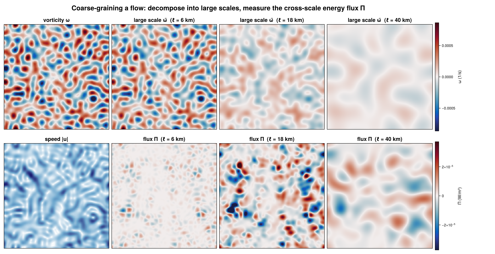

### Spatial filtering across scales
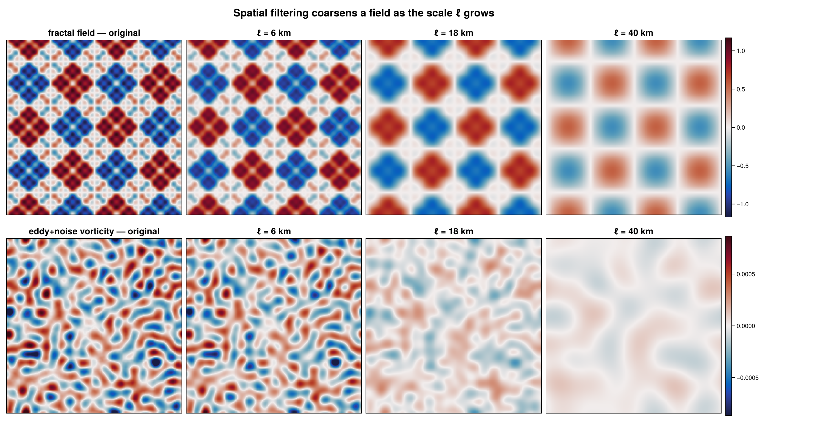

### Filter kernels and spectral transfer
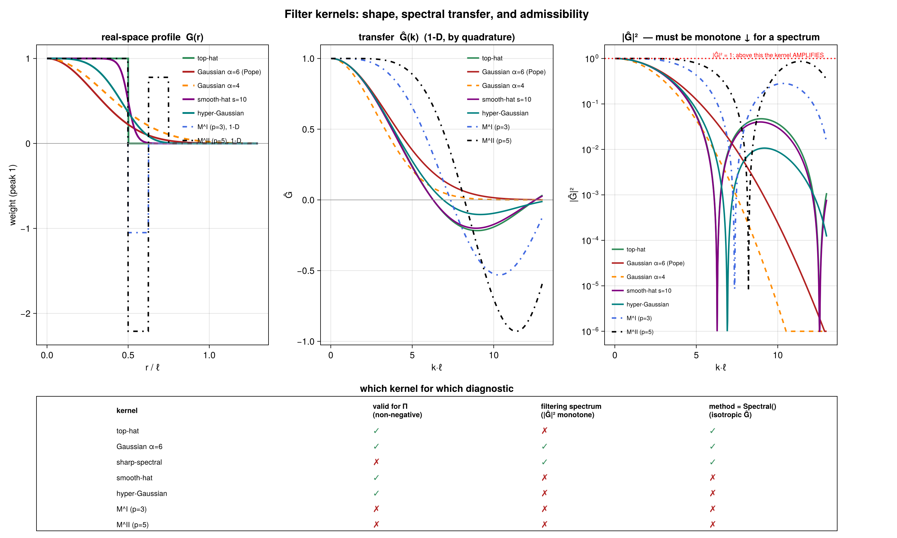

### The filtering spectrum (recovers the Fourier slope)
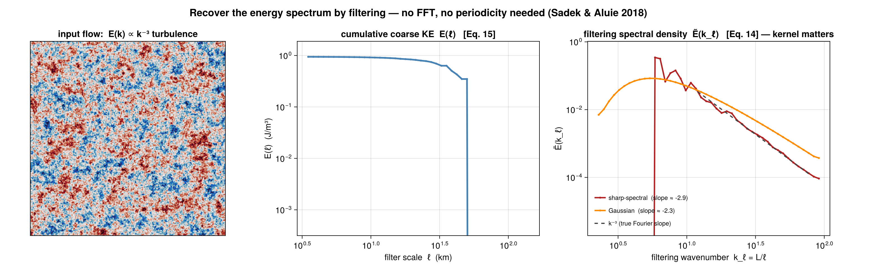

### Rotational / divergent (Helmholtz) decomposition of Π
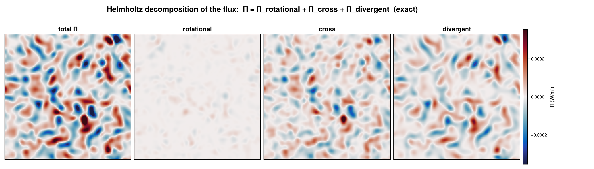

### Strain / convergence split of Π
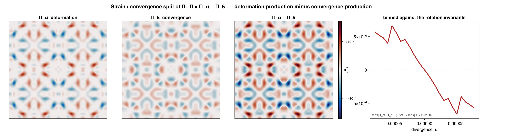

### Enstrophy flux (the 2-D companion to Π)
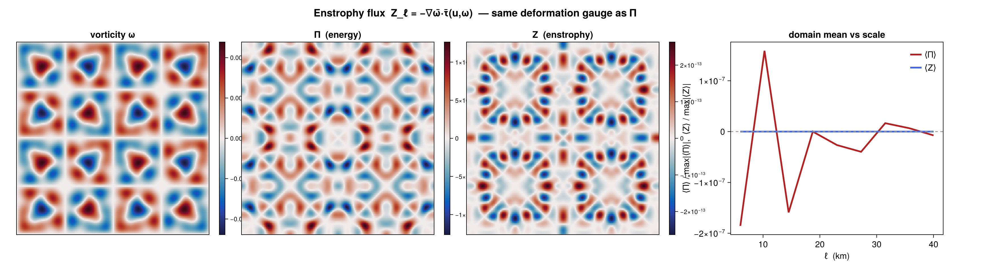

### Energy by scale band
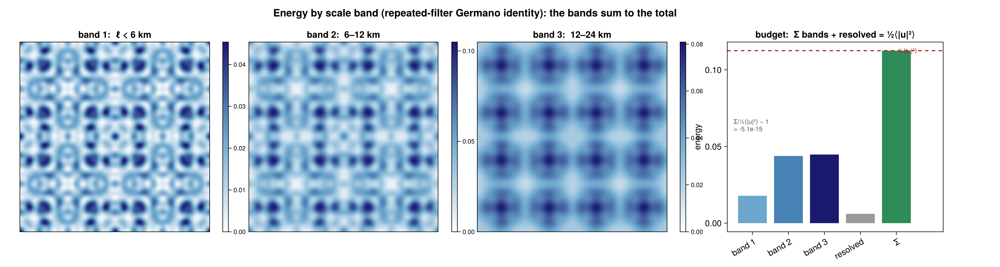

### Variable-density (Favre) budget: Π, baropycnal work Λ
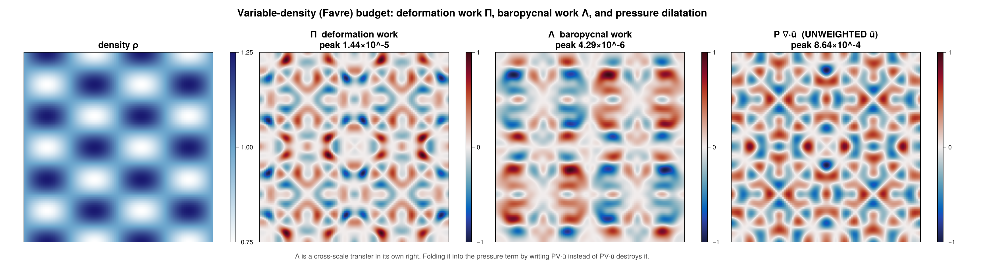

### Cross-scale tracer / buoyancy-variance flux
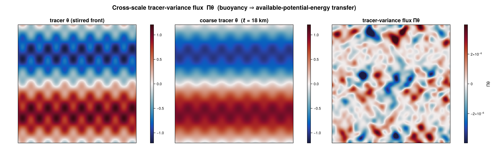

### Masking: zero-fill vs deformable
`ZeroFill` is the default: land and the domain exterior count as fluid at rest and the kernel keeps its
full mass at every cell, so filtering commutes with spatial derivatives — the step the flux budget is
derived by — and conserves the domain integral. `Deformable` renormalizes over the locally-active area,
reproducing constants exactly next to a boundary at the cost of both.

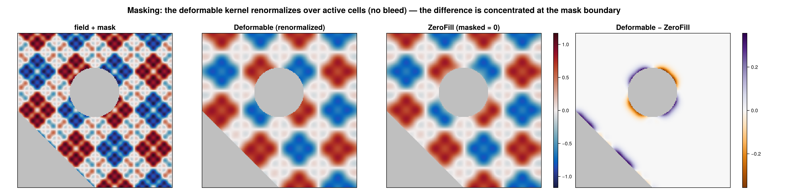

### Spectral filtering on the sphere
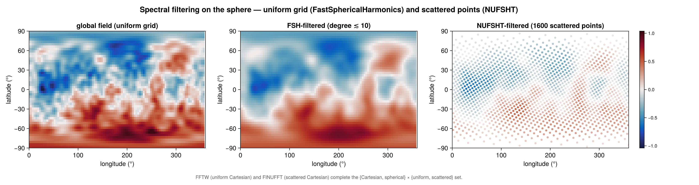

### Validation: rigid-body rotation → Π = 0
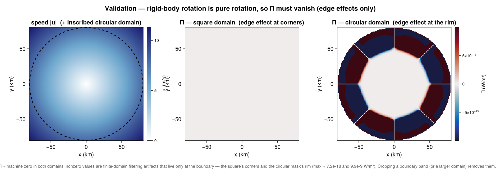

### Curvilinear (model-native) grids
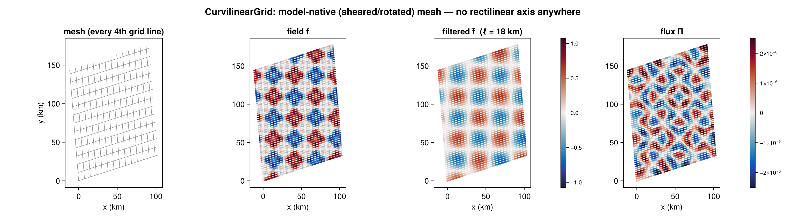

### Scattered / unstructured point clouds
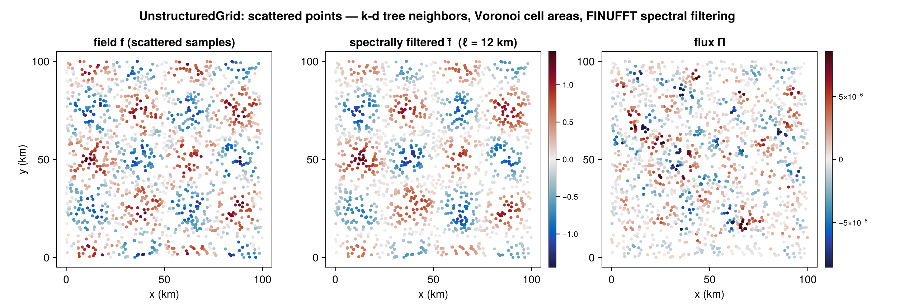

### True 3D volumetric flux
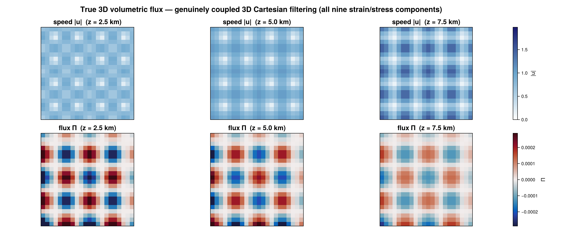

### Vertical profile (2.5D per-level) vertical structure
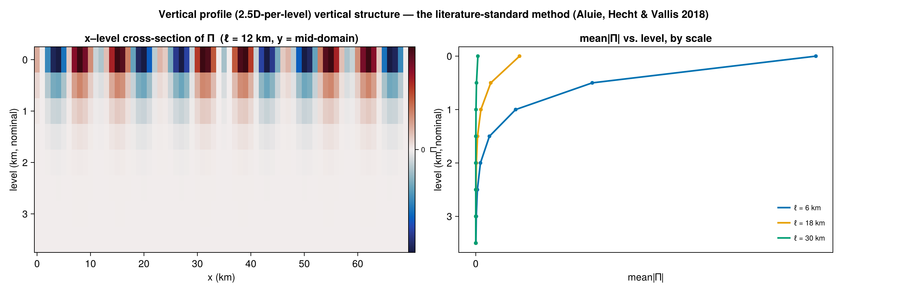

## Cartesian domain — flux at one scale and across scales

```julia
using CoarseGrainingEnergyFluxes: CoarseGrainingEnergyFluxes as CGEF
using FlowGeometries: FlowGeometries as FG

dx = 1_000.0; N = 100                       # 100 km × 100 km patch, 1 km spacing
geom = FG.Geometry.CartesianGeometry()
xs = collect(0.0:dx:(N - 1) * dx)
ys = collect(0.0:dx:(N - 1) * dx)
grid = FG.Grids.StructuredGrid(geom, xs, ys)   # no mask ⇒ `AllActive`; see below to exclude cells

u = randn(N, N); v = randn(N, N)            # replace with your data

# Π at a single 10 km scale.
Π = zeros(N, N)
CGEF.Diagnostics.compute_Π!(Π, u, v, nothing, grid, CGEF.TopHatKernel(), 10_000.0)

# Multi-scale sweep (plan reuse handled internally).
scales = collect(5e3:5e3:50e3)
result = CGEF.coarse_grain(u, v, grid; scales = scales, kernel = CGEF.TopHatKernel(),
                           spectrum = CGEF.Diagnostics.NoSpectrum())
@view result.Π[:, :, 3]      # flux map at scales[3] — result.Π is a stacked (Nx,Ny,Nscales) array
result.cumulative_energy     # ½⟨|ū_ℓ|²⟩ per scale, per unit mass (Sadek–Aluie Eq. 15)
result.wavenumber            # k_ℓ = L/ℓ

# The spectral density needs a kernel whose |Ĝ|² is monotone — see the note below.
spec = CGEF.coarse_grain(u, v, grid; scales = scales, kernel = CGEF.GaussianKernel())
spec.filtering_spectrum      # Ẽ(k_ℓ) density (Eq. 14)
```

!!! note "The top-hat's filtering spectrum is not guaranteed non-negative"
    `TopHatKernel`'s `|Ĝ|²` is not monotone decreasing, so Sadek & Aluie (2018) eq. 21 does not apply
    and the spectral density may dip below zero. That condition is **sufficient, not necessary** — the
    top-hat's `|Ĝ|²` falls to zero at `kℓ ≈ 7.66` and then climbs back to only `0.0175` at `kℓ ≈ 10.27`
    (the first Airy sidelobe; later ones reach `0.0042` and `0.0016`), so the violation is confined to
    the far sub-filter tail at under 2% of the DC value. The density is usually perfectly usable and
    the default merely declines to vouch for it. Three ways forward, per
    [`Diagnostics.AbstractSpectrumPolicy`](@ref):

    | you want | pass |
    |---|---|
    | a density you don't have to check | `kernel = CGEF.GaussianKernel()` |
    | the top-hat's density, sign checked yourself | `spectrum = CGEF.Diagnostics.ForceSpectrum()` |
    | only `Π` and `cumulative_energy` | `spectrum = CGEF.Diagnostics.NoSpectrum()` |

    `Π` and `cumulative_energy` are unaffected by the choice — neither depends on the condition. See
    [`Kernels.transfer_monotone`](@ref).

## Spherical domain with a mask

```julia
using CoarseGrainingEnergyFluxes: CoarseGrainingEnergyFluxes as CGEF
using FlowGeometries: FlowGeometries as FG

geom = FG.Geometry.SphericalGeometry(6.371e6)
lon = deg2rad.(collect(0.0:0.25:359.75))
lat = deg2rad.(collect(-80.0:0.25:80.0))
grid = FG.Grids.StructuredGrid(geom, lon, lat)   # full-circle lon ⇒ periodic auto-detected
# u, v = load_velocity(...)

scales = collect(10e3:10e3:300e3)
result = CGEF.coarse_grain(u, v, grid; scales = scales, kernel = CGEF.TopHatKernel(),
                           spectrum = CGEF.Diagnostics.NoSpectrum())
```

The `ZeroFill` mask strategy (default) treats land as fluid at rest and keeps the kernel's full mass,
so filtering commutes with spatial derivatives — the property the Π budget is derived by — and `Π`
over land is the flux of the zero-extended field. A latitude edge short of a pole continues to the
pole, so a regional grid's kernel mass is the same as a global one's. Pass
`mask_strategy = CGEF.Filtering.Deformable()` to renormalize the kernel over active points near the
boundary instead: that reproduces a constant field exactly there, but the kernel changes shape, so it
neither commutes with derivatives nor conserves the domain average. See
[`Filtering.filter_field!`](@ref).

## Curvilinear (model-native) grids

`CurvilinearGrid` needs no rectilinear axis assumption at all — every point carries its own
`(x, y)`, and derivatives/filtering/`Π` all work directly off the 2D coordinate arrays via a
per-point footprint and weighted-least-squares (WLSQ) gradients. A common source is a
structured-grid ocean/atmosphere model's curvilinear cell-center grid; here's a synthetic
sheared/rotated example:

```julia
using CoarseGrainingEnergyFluxes: CoarseGrainingEnergyFluxes as CGEF
using FlowGeometries: FlowGeometries as FG

N = 60; dx = 2_000.0
geom = FG.Geometry.CartesianGeometry()
i = collect(0.0:(N - 1)); j = collect(0.0:(N - 1))
θ = deg2rad(15.0); shear = 0.3                       # rotate + shear a rectilinear index grid
x = [dx * (ii * cos(θ) - jj * shear * sin(θ)) for ii in i, jj in j]
y = [dx * (ii * sin(θ) + jj * (1 + shear * cos(θ))) for ii in i, jj in j]
grid = FG.Grids.CurvilinearGrid(geom, x, y)     # exact corner-based cell areas, auto-reconstructed

u = randn(N, N); v = randn(N, N)
result = CGEF.coarse_grain(u, v, grid; scales = collect(10e3:10e3:60e3),
                           kernel = CGEF.TopHatKernel(), spectrum = CGEF.Diagnostics.NoSpectrum())
```

## Scattered / unstructured point clouds

`UnstructuredGrid` is the full pipeline for genuinely scattered observations (moorings, drifters,
along-track altimetry): k-d tree neighbor search and Voronoi cell areas at construction time, WLSQ
gradients over that adjacency, and both filtering methods. `RealSpace()` is the default, as on every
other grid: the compact kernel applied exactly as written, through a gather over each point's metric
ball, which holds next to a boundary or a masked region. `method = CGEF.Filtering.Spectral()` is the
`O(n log n)` spectral filter: it estimates the Fourier coefficients on a box with the quadrature rule of
the grid's cell areas and multiplies by `Ĝ(k)`. The box is the grid's `period` in a direction declared
periodic; elsewhere it pads the record (extent plus one spacing) as FFTW pads a bounded axis, the field
being zero beyond the record. On a uniform lattice this is the FFTW result on the same grid.

```julia
using CoarseGrainingEnergyFluxes: CoarseGrainingEnergyFluxes as CGEF
using FlowGeometries: FlowGeometries as FG
using NearestNeighbors: NearestNeighbors        # enables k-d tree neighbor search
using DelaunayTriangulation: DelaunayTriangulation  # enables exact Voronoi cell areas (Cartesian)
using FINUFFT: FINUFFT                          # enables scattered-Cartesian spectral filtering

npts = 2_000
geom = FG.Geometry.CartesianGeometry()         # a placeholder — UnstructuredGrid has no fixed spacing
x = 100_000.0 .* rand(npts)
y = 100_000.0 .* rand(npts)
grid = FG.Grids.UnstructuredGrid(geom, x, y; k = 8)   # k-nearest adjacency + auto Voronoi areas

u = randn(npts); v = randn(npts)
Π = zeros(npts)
CGEF.Diagnostics.compute_Π!(Π, u, v, nothing, grid, CGEF.GaussianKernel(), 8_000.0)
```

For scattered spherical observations, build `grid` with `FG.Geometry.SphericalGeometry(R)` instead and load
`Quickhull` (Voronoi areas) and `NUFSHT` (spectral filtering) in place of `DelaunayTriangulation`/
`FINUFFT`.

## Sphere pixelizations: ring, cubed-sphere, healpix, icosahedral, Yin–Yang

A model that stores one value per cell and names that cell by a single index is served by the same
engine as a scattered point cloud: a gather over each cell's own metric ball, with each cell weighted
by its own area. The grid declares `Grids.cell_address(grid) === Grids.FlatCells()` and the whole
pipeline follows — filtering, gradients, `compute_Π!`, a scale sweep, every execution backend, and
the tensor diagnostics (`tau_decomposition`, `tracer_variance_flux`, `vorticity`, `enstrophy_flux`,
and on a Cartesian metric `compute_Π_strain_convergence`, `compute_Π_decomposed` and
`compressible_flux`). Nothing in the call names the layout.

```julia
using CoarseGrainingEnergyFluxes: CoarseGrainingEnergyFluxes as CGEF
using FlowGeometries: FlowGeometries as FG

geom = FG.Geometry.SphericalGeometry(6.371e6)

grid = FG.Grids.HEALPixGrid(geom, 64)               # 12·64² = 49,152 equal-area pixels
# grid = FG.Grids.CubedSphereGrid(geom, 48)         # 6 faces of 48²
# grid = FG.Grids.IcosahedralGrid(geom, 32)         # 10·32² + 2 vertices
# grid = FG.Grids.YinYangGrid(geom, 192, 96)        # two overlapping lat-lon panels
# grid = FG.Grids.RingGrid(geom, FG.SphericalSampling.ReducedGaussianSampling(nlon_per_ring))

n = length(FG.Grids.mask(grid))
u = randn(n); v = randn(n)                          # one value per cell, in the grid's own ordering

Π = zeros(n)
CGEF.Diagnostics.compute_Π!(Π, u, v, nothing, grid, CGEF.GaussianKernel(), 300e3)

result = CGEF.coarse_grain(u, v, grid; scales = collect(100e3:100e3:600e3),
                           kernel = CGEF.GaussianKernel(),
                           spectrum = CGEF.Diagnostics.NoSpectrum())
```

Pass `mask = <Vector{Bool}>` to any of these constructors for a regional or land-masked domain; the
mask strategies behave as they do everywhere else. These layouts store no coordinate arrays — a cell's
position, neighbours and area are arithmetic in the resolution parameter — so `Grids.coordinates` is
unavailable on them and `check_setup` reports no axis spacing.

## True 3D volumetric flux (Cartesian and spherical)

Distinct from the vertical-profile method below: a true 3D `StructuredGrid` filters in all three
directions with one kernel and computes the genuinely coupled 9-component strain/stress
contraction — the right tool for homogeneous/isotropic turbulence, not the standard
large-scale thin-layer level-stacking approach.

```julia
using CoarseGrainingEnergyFluxes: CoarseGrainingEnergyFluxes as CGEF
using FlowGeometries: FlowGeometries as FG

# Cartesian: (x, y, z) all uniform Range axes.
N = 24; dx = 500.0
geom = FG.Geometry.CartesianGeometry()
x = collect(0.0:dx:(N - 1) * dx); y = copy(x); z = copy(x)
grid = FG.Grids.StructuredGrid(geom, x, y, z)

u = randn(N, N, N); v = randn(N, N, N); w = randn(N, N, N)
Π = zeros(N, N, N)
CGEF.Diagnostics.compute_Π!(Π, u, v, w, grid, CGEF.TopHatKernel(), 5_000.0)

# Spherical volumetric shell: (lon, lat, radius); Nz ≥ 2 is required (else use the 2D constructor).
R = 6.371e6
sgeom = FG.Geometry.SphericalGeometry(R)
lon = deg2rad.(collect(0.0:2.0:358.0)); lat = deg2rad.(collect(-80.0:2.0:80.0))
r = collect((R - 2000.0):500.0:R)                     # 5 levels spanning the top 2 km
sgrid = FG.Grids.StructuredGrid(sgeom, lon, lat, r)
```

## Vertical profile (2.5D per-level) vertical structure

The literature-standard method (Aluie, Hecht & Vallis 2018): run the existing 2D/2.5D `compute_Π!`
independently at each vertical level of a 3D `(x, y, z)` array and stack the profile — not to be
confused with the coupled true-3D method above.

```julia
using CoarseGrainingEnergyFluxes: CoarseGrainingEnergyFluxes as CGEF
using FlowGeometries: FlowGeometries as FG

geom = FG.Geometry.CartesianGeometry()
N = 80; Nz = 6
xs = collect(0.0:1_000.0:(N - 1) * 1_000.0)
grid = FG.Grids.StructuredGrid(geom, xs, xs)    # a 2D grid — z is a third array axis

u = randn(N, N, Nz); v = randn(N, N, Nz)                 # (x, y, z)
scales = collect(5e3:5e3:30e3)
batch = CGEF.coarse_grain_profile(u, v, grid; scales = scales, kernel = CGEF.TopHatKernel(),
                                  spectrum = CGEF.Diagnostics.NoSpectrum())
# The vertical axis is a batch axis, so it is TRAILING: Π is (x, y, scale, level).
batch.Π[:, :, 3, :]                 # flux profile at scales[3], all Nz levels
batch.cumulative_energy[3, :]       # per-level cumulative energy at scales[3]
batch.slices[2].Π                   # level 2's own (x, y, scale) result, a zero-copy view
```

## Execution backends (real-space `RealSpace`)

The backend only changes *how* the same footprint convolution is evaluated — results are identical.
Every backend reuses a footprint/plan built once per `(grid, kernel, scale)`, not rebuilt per call.

```julia
using OhMyThreads: OhMyThreads          # enables ThreadedBackend (2D row-parallel + 1D/3D point-parallel)
result = CGEF.coarse_grain(u, v, grid; scales = scales, spectrum = CGEF.Diagnostics.NoSpectrum(), backend = CGEF.ComputationalBackends.ThreadedBackend())

using KernelAbstractions: KernelAbstractions   # enables GPUBackend (2D grids only)
# Takes the device to run on — `KernelAbstractions.CPU()` here, `CUDABackend()`/`ROCBackend()` on a GPU.
result = CGEF.coarse_grain(u, v, grid; scales = scales, spectrum = CGEF.Diagnostics.NoSpectrum(),
                           backend = CGEF.ComputationalBackends.GPUBackend(KernelAbstractions.CPU()))

using MPI: MPI                          # enables MPIBackend (2D grids; requires MPI.Init() first)
result = CGEF.coarse_grain(u, v, grid; scales = scales, spectrum = CGEF.Diagnostics.NoSpectrum(), backend = CGEF.ComputationalBackends.MPIBackend())

# AutoBackend (default) picks ThreadedBackend when Threads.nthreads() > 1, else SerialBackend.
```

`MPIBackend`'s real multi-rank behavior (round-robin row decomposition + `Allreduce!`) is only
meaningfully exercised under `mpiexec -n P`; see `test/mpi_runtests.jl` for a runnable reference.

## Planning a sweep once instead of once per scale

A filter plan splits by how often each part changes: what the **grid** fixes (transform objects,
measure prefix scans, a scattered point sort), what the **scale** fixes (tap tables, `Ĝ(ℓ)`, the
reciprocal window mass), and transient **scratch**. `plan_filter` builds one of each for a single
scale; [`Filtering.plan_filter_sweep`](@ref) builds the grid part and the scratch once for a whole
sweep and gives each scale only its own tables.

```julia
scales = collect(10e3:10e3:80e3)
family = CGEF.Filtering.plan_filter_sweep(grid, CGEF.TopHatKernel(), scales)

# The allocating entry point sizes the result and a workspace; hand both, plus the family, to the
# in-place one for every later timestep.
result = CGEF.coarse_grain(u, v, grid; scales = scales, spectrum = CGEF.Diagnostics.NoSpectrum())
ws = CGEF.Diagnostics.ΠWorkspace(grid)
for t in 2:nt
    CGEF.coarse_grain!(result, us[t], vs[t], grid; scales = scales,
                       filter_plans = family, workspace = ws,
                       spectrum = CGEF.Diagnostics.NoSpectrum())
end
```

A `FilterPlanFamily` is an `AbstractVector` of the per-scale plans, so it can be indexed, iterated, and
passed anywhere a plain vector of plans was. `coarse_grain` builds one internally for a one-shot sweep;
`coarse_grain!` is the entry point that takes a prebuilt one.

Because the scales of one family share a scratch buffer, **a family may not be applied from several
tasks at once**. Give each concurrent worker its own — the batch and slice drivers already do.

## Choosing the evaluator: `AutoMethod()`

`RealSpace()` computes the direct sum. `AutoMethod()` picks the fastest engine that computes the *same*
convolution, which on some grids means evaluating it by transform:

```julia
# Global sphere + a radial kernel: each latitude band becomes a circular convolution along longitude.
res_fast = CGEF.coarse_grain(u, v, sphere_grid; scales = scales, kernel = CGEF.GaussianKernel(),
                             method = CGEF.Filtering.AutoMethod(),
                             spectrum = CGEF.Diagnostics.NoSpectrum())

# Which engine did that pick, and what would RealSpace() have used?
CGEF.check_setup(sphere_grid, CGEF.GaussianKernel(), 800e3; method = CGEF.Filtering.AutoMethod())
CGEF.check_setup(sphere_grid, CGEF.GaussianKernel(), 800e3)   # notes that AutoMethod would be faster
```

These are the same compact kernel with the same weights, so they agree with the direct sum to
round-off rather than exactly — which is why `RealSpace()` remains the default. Neither is
`method = Spectral()`: no transfer function is sampled and no spherical-harmonic truncation happens.

## Workspaces sized to what you asked for

Each in-place diagnostic takes a workspace holding only the buffers its configuration can reach:

```julia
ws  = CGEF.Diagnostics.ΠWorkspace(grid)                  # 2-D flux, no vertical component
wsw = CGEF.Diagnostics.ΠWorkspace(grid; has_w = true)    # 2.5-D: adds the vertical-component buffers
ew  = CGEF.Diagnostics.EnergyWorkspace(grid)             # E(ℓ) reads only filtered velocity: 2 buffers

CGEF.Diagnostics.compute_Π!(Π, u, v, nothing, grid, kernel, ℓ; workspace = ws)
CGEF.Diagnostics.cumulative_energy!(E, u, v, nothing, grid, kernel, scales; workspace = ew)
```

`has_w` must be given at construction, because the buffers have to exist before the first call — a
workspace built without them refuses a `w` rather than returning a wrong answer. Spherical and true-3-D
grids always carry the full set, since the spherical branch works in three planetary-Cartesian
components whether or not a vertical velocity was supplied.

## Spectral filtering (`method = Spectral()`)

Spectral filtering multiplies by Ĝ(k) and is selected by the grid type (FFTW / FINUFFT /
FastSphericalHarmonics / NUFSHT). A bounded Cartesian direction is zero-padded, so the result is the
filter of the field extended by zero beyond the domain; the spherical-harmonic transforms need the whole
sphere. A partial mask is supported by normalized convolution, `ZeroFill`/`Deformable` defined as for
`RealSpace()`. `GaussianKernel`/`SharpSpectralKernel` filter spectrally with no extra dependency;
`TopHatKernel` needs `using SpecialFunctions` (for its exact planar Bessel-`J₁` transfer function — the
spherical-cap analog needs no extra dependency), as does `SharpSpectralKernel` in real space on a
two-dimensional grid.

```julia
using FlowGeometries: FlowGeometries as FG
using FFTW: FFTW                       # uniform Cartesian
N = 128; dx = 1.0
geom = FG.Geometry.CartesianGeometry()
x = collect(0.0:dx:dx*(N - 1))
grid = FG.Grids.StructuredGrid(geom, x, x; periodic = (true, true))

out = zeros(N, N)
CGEF.Filtering.filter_field!(out, u, grid, CGEF.GaussianKernel(), 4.0; method = CGEF.Filtering.Spectral())
```

Scattered Cartesian points use `FINUFFT` on an `UnstructuredGrid{Cartesian}`; uniform spherical grids
use `FastSphericalHarmonics` on a `StructuredGrid{Spherical}`; scattered spherical points use `NUFSHT`
on an `UnstructuredGrid{Spherical}`. In every case the call is the same `filter_field!(…; method =
CGEF.Filtering.Spectral())` — only the grid type differs.

## Rotational / divergent (Helmholtz) flux decomposition

Pass the rotational (solenoidal) velocity from a Helmholtz solver
([HelmholtzDecomposition.jl](https://github.com/jbphyswx/HelmholtzDecomposition.jl)); the divergent
part is taken as the complement. Both the strain and the stress are split before contracting (see
[Theory](theory.md)), giving three exact channels rather than a one-sided approximation.

```julia
using CoarseGrainingEnergyFluxes: CoarseGrainingEnergyFluxes as CGEF
# u_rot, v_rot = HelmholtzDecomposition.rotational_part(u, v, grid)

dec = CGEF.Diagnostics.compute_Π_decomposed(u, v, u_rot, v_rot, grid, CGEF.TopHatKernel(), 20_000.0)
dec.total        # == compute_Π! full flux
dec.rotational   # Π_RR   (rotational → rotational)
dec.cross        # Π_X    (every interaction / "stimulated cascade" term)
dec.divergent    # Π_DD   (divergent → divergent)      dec.rotational .+ dec.cross .+ dec.divergent ≈ dec.total
```

The true-3D method has the same signature with `w`/`w_rot` added, on a Cartesian volume or a spherical
shell.

On a spherical grid the call is identical. The three stress pieces are formed as generalized second
moments in planetary-Cartesian coordinates and rotated back to the local frame, and each part's strain
carries the frame's `tanφ/R` curvature terms, so `dec.total` still equals `compute_Π!` — the suite
asserts it. Pass `SphericalPiDecomposedWorkspace(grid)` to `compute_Π_decomposed!` to reuse the
buffers across a sweep.

## Tracer / buoyancy variance flux

```julia
# θ is any tracer (buoyancy b = -g ρ'/ρ₀ gives the APE-related transfer).
Πθ = CGEF.Diagnostics.tracer_variance_flux(u, v, θ, grid, CGEF.TopHatKernel(), 20_000.0)
```

A true-3D method exists too (`tracer_variance_flux(u, v, w, θ, grid, kernel, scale)`). On a spherical
grid the velocity is rotated to planetary Cartesian before filtering and the subfilter tracer flux
rotated back to east/north(/radial), the same convention `compute_Π!` uses.

## Stress decomposition (Leonard / Cross / Reynolds)

```julia
d = CGEF.Diagnostics.tau_decomposition(u, v, grid, CGEF.TopHatKernel(), 20_000.0)
d.L.xx; d.C.xy; d.R.yy        # d.L + d.C + d.R == τ exactly
```

On a spherical grid, `xx`/`xy`/`yy` are local east/north components (the moments are taken in
planetary-Cartesian coordinates, then rotated back — see [Theory](theory.md)).

Add `w` for the true-3-D split, on a Cartesian volume or a spherical shell. Each tensor then comes
back with all six independent components, `(; xx, xy, xz, yy, yz, zz)`, and `L + C + R = τ` holds
componentwise:

```julia
d3 = CGEF.Diagnostics.tau_decomposition(u, v, w, grid3d, CGEF.GaussianKernel(), 20_000.0)
d3.L.xz; d3.C.yz; d3.R.zz
```

## Strain / convergence decomposition of Π

The same flux split by diagonalizing the filtered strain instead of decomposing the velocity
(Srinivasan, Barkan & McWilliams 2023). `Π_α` is deformation production, `Π_δ` the frontogenetic
convergence term that vanishes for a non-divergent field.

```julia
d = CGEF.Diagnostics.compute_Π_strain_convergence(u, v, grid, CGEF.TopHatKernel(), 20_000.0)
d.total                       # == compute_Π! to round-off; the suite asserts it
d.strain                      # Π_α — deformation / shear production
d.convergence                 # Π_δ — convergence production (zero if ∇·u = 0)
d.divergence                  # δ̄, a rotation invariant: the natural axis to bin the flux against
d.strain_magnitude            # ᾱ, likewise

# Reuse across timesteps or scales without reallocating:
ws = CGEF.Diagnostics.PiStrainWorkspace(grid)
CGEF.Diagnostics.compute_Π_strain_convergence!(ws, u, v, grid, ker, ℓ;
                                               filter_plan = plan, deriv_plan = dplan)
```

## Enstrophy flux

The enstrophy analogue of `Π`, in the same (deformation) gauge — in 2-D turbulence this cascades
forward while `Π` cascades inverse, so the two are read together.

```julia
ω = CGEF.Diagnostics.vorticity(u, v, grid)            # ∂v/∂x − ∂u/∂y
Z = CGEF.Diagnostics.enstrophy_flux(u, v, grid, CGEF.GaussianKernel(), 20_000.0)

ws = CGEF.Diagnostics.EnstrophyFluxWorkspace(grid)    # zero-allocation repeat
CGEF.Diagnostics.enstrophy_flux!(Z, ws, u, v, grid, ker, ℓ; filter_plan = plan, deriv_plan = dplan)
```

## Energy by scale band

The repeated-filter Germano identity, which splits the kinetic energy into bands that **sum to the
total** — unlike band-passing the velocity, whose cross terms have indefinite sign.

```julia
# `scales` ASCENDING: band n is what the n-th, progressively coarser, filter removes.
# `maps = true` adds the pointwise fields; without it only the scalars are formed.
r = CGEF.Diagnostics.band_energies(u, v, grid, CGEF.GaussianKernel(), [3e3, 6e3, 12e3];
                                   maps = true)
r.bands                       # domain-mean energy per band
r.resolved                    # what is left above the coarsest scale
r.total                       # == ½⟨|u|²⟩ exactly on a periodic, unmasked grid
r.band_maps[2]                # the pointwise map for band 2
```

Use a **non-negative** kernel here: band energies are variances, and they are pointwise positive only
if the kernel is. The identity is exact on a periodic unmasked domain and carries an `O(ℓ/L)` residual
wherever the footprint truncates — see [`Diagnostics.band_energies`](@ref) for the measured numbers.

## Visualization (CairoMakie extension)

```julia
using CairoMakie: CairoMakie               # provides plot_Π_map / plot_spectrum methods
result = CGEF.coarse_grain(u, v, grid; scales = collect(10e3:10e3:100e3),
                           kernel = CGEF.GaussianKernel())   # a spectrum-admissible kernel

fig1 = CGEF.plot_Π_map(result, 3, grid)               # flux map at scales[3]
fig2 = CGEF.plot_spectrum(result; which = :density)   # filtering spectral density Ẽ(k_ℓ)
fig3 = CGEF.plot_spectrum(result; which = :cumulative) # cumulative coarse KE vs ℓ
```
